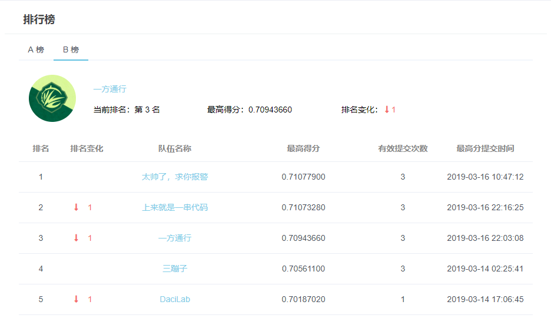
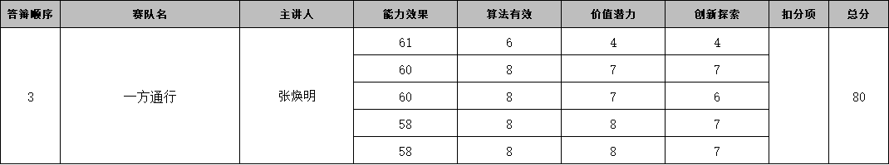

## DataFountain-海上风场SCADA数据缺失智能修复

[赛题详情](https://www.datafountain.cn/competitions/333/details/rule)

提供33个风场，每个风场68个变量在一个月内的数据，部分数据被人为剔除，要求使用剩余数据对缺失数据进行修复。

我们方案在线上比赛的ab榜最终成绩都是第三;

可惜线下答辩比较糟糕，未能晋级，根据比赛评分规则，一切都看线下答辩评委的评分：

### 评分规则：线上效果分，40-70分,为避免作品效果与实际评价出入，结合线上赛成绩排名及现场答辩情况，以10分为梯度共计5档评分（每个团队有分数段重叠），第一、二名60-70分，第三、四名55-65分，第五、六名50-60分，第七、八名45-55分，第九、十名40-50分，评委可在评分范围内给分。

最终评分就这样，两个4分直接把我们队拖到门外了。

主办方倾向于想要一些非传统“特征-目标预测”的模型，我们的方案就中规中矩没啥特色，第一第二名的方案比较牛，多研究他们的方案比较有益。

方案总共分为4部分：

1.数据合并和剔除异常数据；

2.构造验证集和计算特征相关性；

3.规则预测和模型预测；

4.合并结果。

代码说明在[运行环境说明和代码说明.md](./运行环境说明和代码说明.md)

方案说明看[答辩PPT](./一方通行-答辩PPT.pptx)可能详细些。

我们的方案基本就是靠堆特征堆模型堆出来的，因为线上测试集和我们构造的线下验证集分布比较一致，所以只要找到一种特征组合或者一种模型在线下验证集上更好，那线上结果也好，就可以加入到融合结果中，提高一些得分，规则预测的结果也同样适用。

很多人说想要数据，我把复赛数据上传到百度云吧。

链接：https://pan.baidu.com/s/1NoaJbqBF4R1nfspveA03Cw 
提取码：aekh
